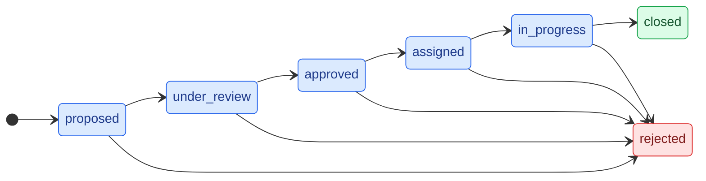
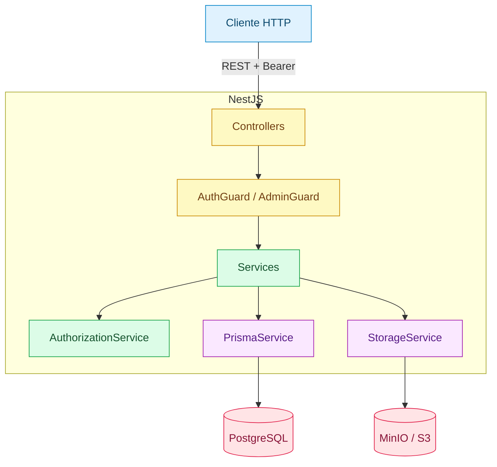
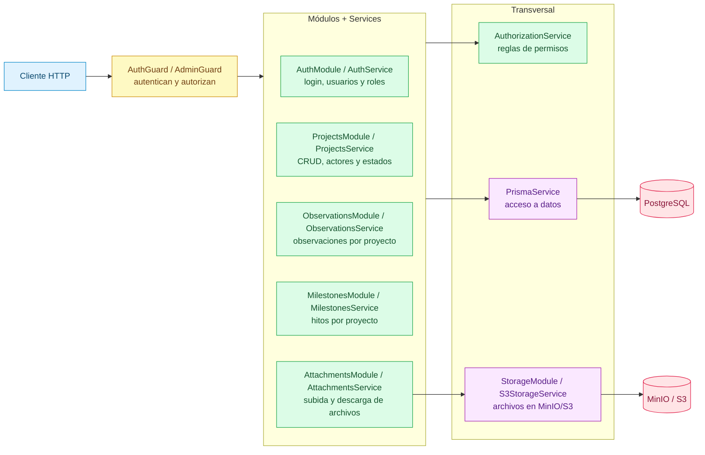

# Arquitectura del Backend

API REST construida con **NestJS 11** sobre **Node.js 26**, usando **Prisma 7**
(adaptador `pg`) y **PostgreSQL 15**. Los archivos se guardan en **MinIO/S3**.
La especificación OpenAPI se publica con Swagger.

Ver también: [Esquema de base de datos](./database_arch.md),
[Arquitectura del frontend](./frontend_arch.md) y el
[plan de SSO](./sso-plan.md).

## Resumen

| Aspecto | Elección |
| --- | --- |
| Framework | NestJS 11 (módulos, controllers, services, guards) |
| Lenguaje | TypeScript sobre Node.js 26 |
| Base de datos | PostgreSQL 15 vía Prisma 7 (adaptador `pg`) |
| Almacenamiento | MinIO localmente, compatible con S3 en producción |
| Autenticación | Tokens HMAC-SHA256 propios + hash de contraseñas con scrypt |
| Documentación | Swagger / OpenAPI en `/api` |
| Pruebas | Tests unitarios con Jest y e2e con Supertest |

## Arranque

`src/main.ts` es el punto de entrada:

- Crea la app a partir de `AppModule`.
- Registra un `ValidationPipe` global (`whitelist` + `transform`), de modo que
  los campos desconocidos se eliminan y los DTOs se convierten a sus tipos.
- Publica Swagger en `/api`.
- Escucha en `PORT` (por defecto `3001`).

`AppModule` importa los módulos de dominio, carga las variables de entorno con
`ConfigModule` y aplica `LoggerMiddleware` a todos los controladores.

### Ciclo de vida de una petición

1. **LoggerMiddleware** registra la petición entrante.
2. Los **guards** (`AuthGuard`, `AdminGuard`) autentican y autorizan.
3. Los **pipes** validan y transforman el body/params en DTOs.
4. El **controller** despacha al método del service correspondiente.
5. El **service** aplica las reglas de negocio, llama a
   `AuthorizationService`, `PrismaService` y/o `StorageService`, y mapea el
   resultado.
6. La respuesta se serializa como JSON (o se envía como stream en descargas).

## Capas

| Capa | Responsabilidad |
| --- | --- |
| **Controller** | Define rutas, valida DTOs y recibe al usuario autenticado. Delgado por diseño. |
| **Guard** | `AuthGuard` valida el token Bearer; `AdminGuard` exige el rol `admin`. |
| **Service** | Lógica de negocio, reglas de estado y mapeo de respuestas. Un service por dominio. |
| **AuthorizationService** | Centraliza las reglas de permisos (rol global + rol en el proyecto). |
| **PrismaService** | Acceso a datos (cliente Prisma con adaptador `pg`). |
| **StorageService** | Abstracción de archivos; la implementación concreta es `S3StorageService`. |

Los services devuelven **tipos de respuesta propios** (`ProjectDetailResponse`,
etc.) en lugar de modelos crudos de Prisma, para no filtrar detalles de la base
de datos y mantener estable el contrato de la API aunque cambie el esquema.

## Módulos

| Módulo | Descripción |
| --- | --- |
| **Auth** | Login, gestión de usuarios y asignación de roles. Crea el primer admin. |
| **Projects** | CRUD de proyectos, asignación de actores y transición de estados. |
| **Observations** | Observaciones de texto libre asociadas a un proyecto. |
| **Milestones** | Entregables programados por proyecto. |
| **Attachments** | Subida, listado, descarga y borrado de archivos. |
| **Storage** | Expone `StorageService` para el módulo de anexos (S3/MinIO). |

## Autenticación y autorización

El login (`POST /auth/login`) verifica la contraseña con **scrypt** (sal
aleatoria, clave de 64 bytes) y emite un token **HMAC-SHA256** de 24 horas (sin
librerías externas). `AuthGuard` valida el header
`Authorization: Bearer <token>`, comprueba la expiración y carga el usuario en
`request.user`.

Roles globales (`UserRole`): `admin`, `evaluator`, `coordinator`, `advisor`,
`student`. Roles dentro de un proyecto (`ActorRole`): `advisor`, `coordinator`,
`student`, `evaluator`.

`AuthorizationService` responde preguntas como "¿puede este usuario crear un
proyecto?", "¿puede gestionar este proyecto?" o "¿puede asignar actores?",
combinando el rol global con la asignación en el proyecto. El `admin` siempre
pasa.

### Matriz de permisos

Leyenda: **público** = no requiere token, **miembro** = asignado al proyecto,
**rol** = requiere el rol global más la asignación correspondiente en el
proyecto. El `admin` siempre pasa.

| Acción | Público | admin | coordinator | evaluator | advisor | student |
| --- | :---: | :---: | :---: | :---: | :---: | :---: |
| Listar / ver proyectos | sí | sí | sí | sí | sí | sí |
| Crear proyecto | no | rol | rol | rol | rol | rol |
| Gestionar proyecto / asignar actores | no | sí | miembro | no | no | no |
| Gestionar hitos | no | sí | miembro | miembro | miembro | no |
| Cambiar estado | no | sí | miembro | miembro* | no | no |
| Ver observaciones / hitos / anexos | no | sí | miembro | miembro | miembro | miembro |
| Comentar un proyecto | no | sí | miembro | miembro | miembro | miembro |

- `Crear proyecto` solo requiere que el usuario tenga al menos un rol global.
- \* Los evaluadores solo pueden mover proyectos en `proposed`/`under_review` o
  rechazar cualquier proyecto activo; el resto son acciones de coordinador.

Al arrancar, `AuthService` crea un admin inicial si la base de datos está vacía
y existen `INITIAL_ADMIN_EMAIL`, `INITIAL_ADMIN_PASSWORD` y
`INITIAL_ADMIN_NAME`.

## Ciclo de vida del proyecto

El camino feliz es:

```
proposed → under_review → approved → assigned → in_progress → closed
```

`rejected` es terminal y puede alcanzarse desde cualquier estado activo. Las
transiciones se validan en `ProjectsService`; cada cambio se registra en
`ProjectStatusHistory` dentro de una transacción, exige un motivo (salvo para
`admin`) y respeta los permisos del rol que realiza la transición.

| Desde | Siguientes estados permitidos |
| --- | --- |
| `proposed` | `under_review`, `rejected` |
| `under_review` | `approved`, `rejected` |
| `approved` | `assigned`, `rejected` |
| `assigned` | `in_progress`, `rejected` |
| `in_progress` | `closed`, `rejected` |
| `closed` / `rejected` | — (terminal) |



## Modelo de datos

El esquema Prisma completo está documentado en
[database_arch.md](./database_arch.md). En resumen:

- **Usuario**: `User`, `UserRoleAssignment`.
- **Proyecto**: `Project`, `ProjectSchool`, `ProjectNaturalProposer`,
  `ProjectDeliverable`.
- **Equipo y seguimiento**: `ProjectActorAssignment`, `ProjectObservation`,
  `ProjectStatusHistory`, `ProjectMilestones`.
- **Archivos**: `ProjectAttachment` (solo metadatos; el binario vive en
  S3/MinIO).

## Anexos

`AttachmentsController` recibe `multipart/form-data` mediante `FileInterceptor`
(almacenamiento en memoria). Límite de **10 MB** y lista blanca de MIME (PDF,
Word, Excel, PNG, JPEG). El service sube el archivo a S3 y, si falla el
registro en la base de datos, lo elimina para no dejar huérfanos. Las descargas
se envían como stream con el nombre original en el header `Content-Disposition`.

## Manejo de errores

Se usan las excepciones HTTP integradas de Nest, por lo que las respuestas
siguen una forma consistente (`statusCode`, `message`, `error`):

| Estado | Cuándo |
| --- | --- |
| `400` | DTO inválido, transición de estado inválida o motivo faltante. |
| `401` | Token ausente, malformado o expirado. |
| `403` | Autenticado pero sin rol/asignación en el proyecto. |
| `404` | Proyecto, usuario, hito o anexo no encontrado. |
| `409` | Valor único duplicado (por ejemplo email o asignación de actor). |
| `500` | Configuración requerida faltante (S3, secreto de auth). |

## Configuración

| Variable | Propósito |
| --- | --- |
| `DATABASE_URL` | Cadena de conexión a PostgreSQL. |
| `AUTH_SECRET` | Clave de firma HMAC (mínimo 32 caracteres). |
| `INITIAL_ADMIN_*` | Email, contraseña y nombre del admin inicial. |
| `MAX_FILE_SIZE_BYTES` | Límite de tamaño de anexos (por defecto 10 MB). |
| `S3_ENDPOINT`, `S3_BUCKET`, `S3_ACCESS_KEY`, `S3_SECRET_KEY` | Almacenamiento de archivos. |
| `S3_REGION`, `S3_FORCE_PATH_STYLE` | Ajustes del cliente S3 (`true` para MinIO). |

## Semillas y migraciones

En `prisma/`:

- `schema.prisma` y `migrations/` — esquema y migraciones.
- `seed.ts` + `seed/` — datos de ejemplo por dominio.
- `fixtures/` — datos JSON y archivos de anexos.

Comandos: `npx prisma migrate dev`, `npm run seed` (y variantes como
`seed:users`, `seed:projects`, etc.).

## Pruebas

- Tests unitarios: `npm test` (Jest, archivos `*.spec.ts` junto al código).
- Watch / cobertura: `npm run test:watch`, `npm run test:cov`.
- End-to-end: `npm run test:e2e` (Supertest).

## Endpoints principales

| Método | Ruta | Descripción |
| --- | --- | --- |
| `POST` | `/auth/login` | Iniciar sesión y recibir un token de acceso (público). |
| `GET/POST` | `/auth/users` | Listar / crear usuarios (admin). |
| `PATCH` | `/auth/users/:id/roles` | Reemplazar los roles de un usuario (admin). |
| `GET` | `/projects` | Listar los proyectos visibles para el solicitante (público: solo finalizados y no privados). |
| `GET` | `/projects/mine` | Proyectos propuestos y asignados al usuario. |
| `GET` | `/projects/:id` | Detalle (404 si el proyecto es privado y el solicitante no es miembro). |
| `POST` | `/projects` | Crear un proyecto; `isPrivate` lo define el proponente. |
| `PUT/DELETE` | `/projects/:id` | Editar / borrar (admin o coordinador asignado). |
| `PATCH` | `/projects/:id/status` | Cambiar estado (registra historial). |
| `POST` | `/projects/:id/actors` | Asignar un usuario a un proyecto. |
| `GET/POST` | `/projects/:id/observations` | Listar / agregar observaciones. |
| `GET/POST/PATCH/DELETE` | `/projects/:id/milestones` | Gestionar hitos. |
| `GET/POST/DELETE` | `/projects/:id/attachments` | Gestionar anexos. |
| `GET` | `/projects/:id/attachments/:aid/download` | Descargar un anexo. |

La autenticación es **global** (`AuthGuard` como `APP_GUARD`): todas las rutas
requieren token salvo las marcadas con `@Public()` (`/auth/login`, `GET /projects`
y `GET /projects/:id`). En las rutas públicas el token es opcional: si llega, se
resuelve el usuario y se adaptan los datos mostrados, y si es inválido se
responde `401` en lugar de degradar a anónimo.

### Visibilidad de proyectos

`AuthorizationService` concentra las reglas:

- `projectVisibilityWhere(viewer)` construye el `where` de Prisma usado por el
  listado: público (`isPrivate = false` y estado `closed`) más `proposerUserId`
  y asignaciones del solicitante; los roles `admin`, `evaluator` y `coordinator`
  ven todo.
- `assertProjectMember` (usado por observaciones, hitos, anexos y entregas)
  permite el acceso al proponente, a los actores asignados y a los roles
  revisores, o cuando el proyecto es público.

## Diagrama



## Resumen para presentación

**AuthModule** es la puerta de identidad: su `AuthService` verifica las
contraseñas con scrypt, emite el token y crea el admin inicial, mientras
`AuthGuard` y `AdminGuard` protegen las rutas y `AuthorizationService`
concentra las reglas de permisos combinando el rol global con el del proyecto.

**ProjectsModule** es el núcleo del dominio. Su `ProjectsService` maneja el CRUD
de proyectos, la asignación de actores y la máquina de estados, registrando cada
cambio en el historial dentro de una transacción.

Los módulos de apoyo son simples y de una sola responsabilidad:
`ObservationsService` agrega y lista observaciones, `MilestonesService` gestiona
los hitos y `AttachmentsService` sube, descarga y borra archivos validando
tamaño y tipo.

En el plano transversal, `StorageModule` expone `StorageService` (implementado
por `S3StorageService`) para guardar los binarios en MinIO/S3 sin atar el código
a un proveedor, y `PrismaService` es la única puerta de acceso a PostgreSQL.
Además, `LoggerMiddleware` da trazabilidad a las peticiones y Swagger publica la
documentación interactiva de la API en `/api`.

### Grafo simplificado de módulos y services


