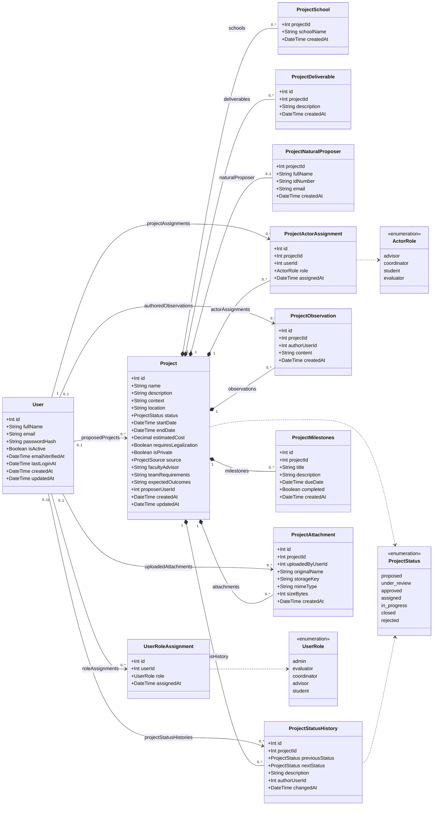

# Esquema de base de datos (Prisma)

La capa de datos es **PostgreSQL**, accedida mediante **Prisma 7**. La fuente
de verdad es `hub-backend/prisma/schema.prisma`; las migraciones viven en
`hub-backend/prisma/migrations/`.

Ver también: [Arquitectura del backend](./backend_arch.md).

## Enums

- `ProjectStatus`: `proposed`, `under_review`, `approved`, `assigned`,
  `in_progress`, `closed`, `rejected`.
- `UserRole`: `admin`, `evaluator`, `coordinator`, `advisor`, `student`.
- `ActorRole`: `advisor`, `coordinator`, `student`, `evaluator`.
- `ProjectSource`: `external_entity`, `research`, `internal_need`,
  `social_impact`.

## Entidades

### User

Cuenta y roles globales. `email` es único e `isActive` controla el acceso. Las
contraseñas se guardan como hash `scrypt`, nunca en texto plano.

### UserRoleAssignment

Tabla intermedia que da a un usuario uno o más roles globales. Única por
`(userId, role)`.

### Project

La entidad central. Contiene campos descriptivos, estado y costo estimado
(opcional), e indica si el proyecto requiere un proceso de legalización
(`requiresLegalization`, por ejemplo contrato de confidencialidad o convenio con
el proponente) y su origen (`source`: entidad externa, investigación, necesidad
interna o impacto social). Incluye además el asesor de facultad recomendado
(`facultyAdvisor`), el equipo requerido (`teamRequirements`), las expectativas
finales (`expectedOutcomes`) y una lista de entregables. `startDate` es opcional.
Es dueña de todos los registros relacionados mediante borrado en cascada.

#### Privacidad y visibilidad

- `isPrivate` (por defecto `true`) lo decide el proponente en el formulario de
  propuesta. Un proyecto privado nunca se publica.
- `proposerUserId` apunta al `User` que registró la propuesta (relación
  `ProjectProposedBy`, `SetNull` al eliminar el usuario). Permite que el
  proponente consulte sus proyectos aunque no tenga una asignación de actor.
- Reglas de visibilidad:
  - `closed` y `isPrivate = false` → **público**: cualquier visitante (incluso
    sin sesión) puede verlo en el listado y el detalle.
  - `rejected` → **siempre privado**, nunca se publica.
  - Cualquier otro estado → privado: visible solo para `admin`, `evaluator` y
    `coordinator`, el proponente y los usuarios con `ProjectActorAssignment`.
- A los visitantes que solo pueden ver la información pública se les ocultan las
  secciones sensibles (equipo, observaciones, hitos, entregas, anexos e
  historial) tanto en la API como en la interfaz.

### ProjectSchool

Escuelas asociadas a un proyecto. Clave primaria compuesta
`(projectId, schoolName)`.

### ProjectDeliverable

Entregables de texto libre asociados a un proyecto (uno a muchos vía
`projectId`). Alimenta el formulario dinámico de entregables.

### ProjectNaturalProposer

Datos opcionales del proponente (`fullName`, `idNumber` opcional, `email`). Un
proyecto tiene como máximo uno (uno a uno vía `projectId`). El proponente puede
representar a una entidad externa, una investigación, una necesidad interna o una
iniciativa de impacto social; el formulario de propuesta es único y flexible.

### ProjectActorAssignment

Vincula un `User` con un `Project` mediante un `ActorRole`. Único por
`(projectId, userId)`.

### ProjectObservation

Comentarios de texto libre sobre un proyecto. El autor es opcional (`SetNull`
al eliminar el usuario).

### ProjectStatusHistory

Bitácora de cambios de estado: `previousStatus`, `nextStatus`, `description`
opcional y autor. Se escribe dentro de la misma transacción que la
actualización de estado.

### ProjectMilestones

Entregables programados con `title`, `description` opcional, `dueDate` y un
flag `completed`.

### ProjectAttachment

Metadatos de un archivo subido. El binario se almacena en S3/MinIO;
`storageKey` es único y apunta al objeto.

## Diagrama de clases UML

## Notas

- Todas las tablas propiedad de un proyecto usan cascada al borrar el
  proyecto, de modo que eliminarlo limpia sus filas dependientes.
- Las referencias a `User` usan `SetNull` cuando el registro debe sobrevivir al
  usuario (observaciones, historial de estado, anexos) y `Cascade` cuando no
  (asignaciones de rol y de actor).
- Hay índices declarados para los filtros comunes: `status`, `startDate` y
  `createdAt` del proyecto, además de claves foráneas y fechas usadas en los
  listados.
