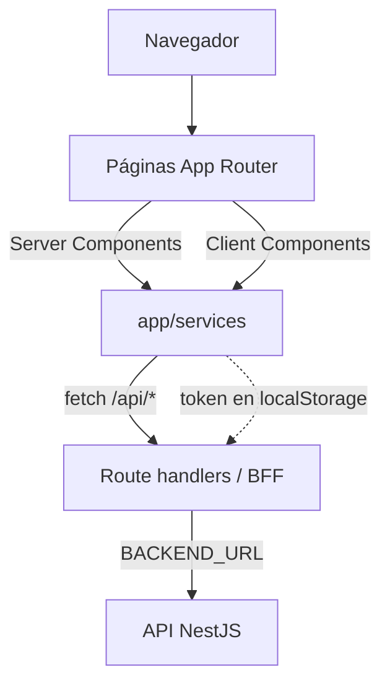

# Arquitectura del Frontend

Aplicación web construida con **Next.js 16 (App Router)**, **React 19** y
**TypeScript**. Los estilos usan **Tailwind CSS v4** y los componentes provienen
de **shadcn/ui** (Base UI + lucide-react). Las tablas se construyen con
**TanStack Table**.

La identidad visual (paleta UTB, tokens, utilidades y convenciones de pantalla)
está en el [Sistema de diseño](./frontend_design_system.md).

Ver también: [Arquitectura del backend](./backend_arch.md),
[Esquema de base de datos](./database_arch.md) y el
[plan de SSO](./sso-plan.md).

## Organización

- `app/` — rutas del App Router.
- `app/api/` — route handlers que actúan como BFF/proxy hacia el backend.
- `app/services/` — acceso a datos y sesión.
- `app/components/` — componentes propios (navbar, auth, formularios).
- `components/ui/` — componentes base de shadcn/ui.
- `lib/utils.ts` — utilidades (por ejemplo `cn`).
- `app/globals.css` — tokens de diseño y utilidades propias.

## Rutas

| Ruta | Pantalla |
| --- | --- |
| `/` | Inicio. |
| `/login` | Inicio de sesión. |
| `/projects` | Lista de proyectos. |
| `/projects/[id]` | Detalle por pestañas (general, equipo, hitos, anexos, historial). |
| `/submit`, `/submit/natural` | Propuesta de proyecto. |
| `/admin/users` | Administración de usuarios y roles. |

## Patrón BFF (Backend For Frontend)

El navegador nunca llama al backend directamente. Cada `app/api/.../route.ts`
recibe la petición, reenvía el header `Authorization` y hace `fetch` a
`BACKEND_URL` (por defecto `http://localhost:3001`), devolviendo la respuesta
tal cual. Esto evita CORS y oculta la URL del backend.

`app/api/auth/proxy.ts` es un helper reutilizable para login y usuarios.

## Capa de servicios

`app/services/` concentra toda la comunicación con la API:

- `auth.ts` — sesión en `localStorage` (`capstonehub.auth.session`) y funciones
  de login/usuarios.
- `projects.ts` — proyectos, hitos, observaciones y anexos.
- `schemas.ts` — tipos TypeScript compartidos (`ProjectDetails`, etc.).
- `utils.ts` — helpers de formato (estados, fechas).

Cada petición autenticada lee el token de `auth.ts` y agrega
`Authorization: Bearer <token>`.

## Autenticación

`AuthProvider` (cliente) mantiene la sesión y la expone por contexto
(`useAuth`). El login guarda usuario + token en `localStorage`; los services
leen el token al hacer peticiones. No hay cookies ni sesión en el servidor.

## Server vs Client Components

- Las páginas cargan datos con Server Components (`getProjects`,
  `getProjectById`) usando `cache: "no-store"`.
- La interactividad (tabla de proyectos, paneles de detalle, diálogos de
  usuarios) vive en Client Components con `"use client"`.

## Configuración y despliegue

- Variable `BACKEND_URL` para el proxy.
- `NEXT_PUBLIC_SITE_URL` como base de la API cuando se llama desde el cliente.
- Build Docker multi-etapa con salida *standalone*, expuesto en el puerto
  `3000`.

## Diagrama

